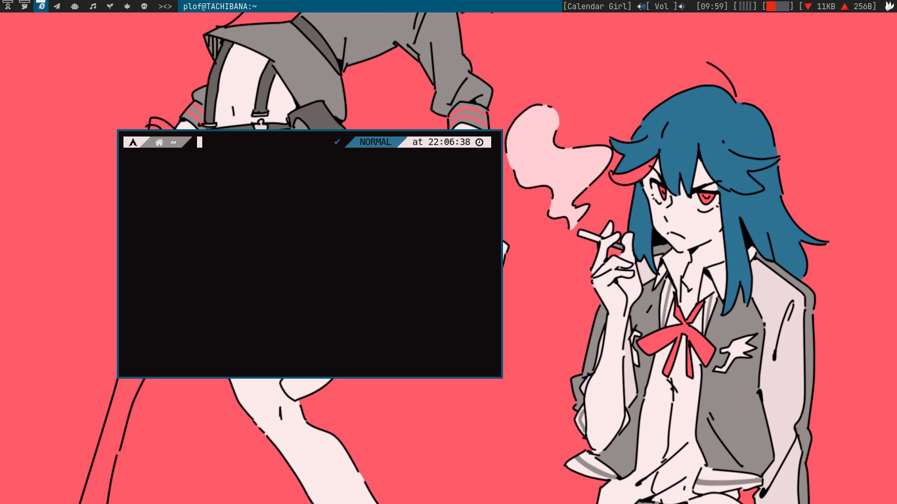
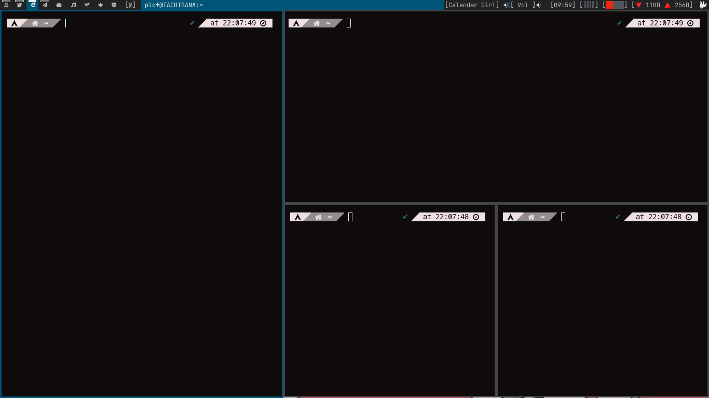
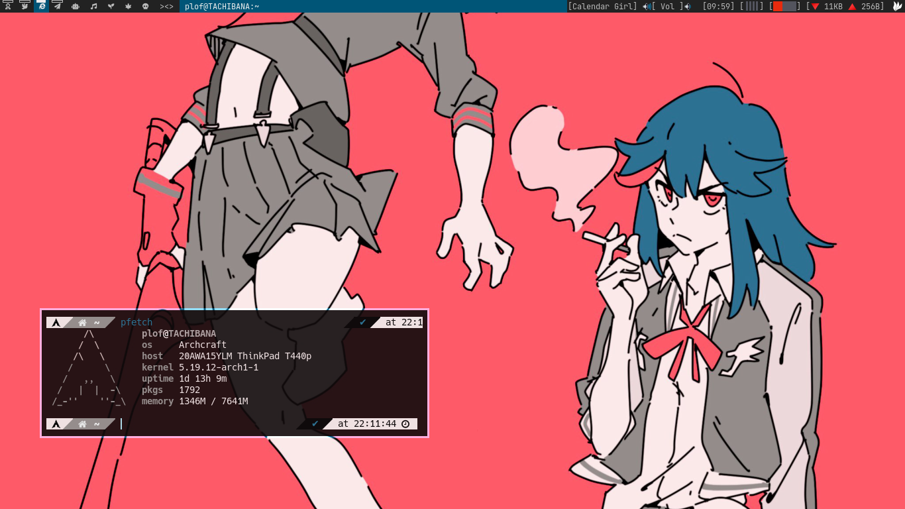

## This is a fork of [this DWM](https://github.com/Bugswriter/dwm)
But this DWM include the next patches:
+ statuscmd
+ status2d
+ movecenter
+ horizgrid
+ savefloatwindow
+ fakefullscreenselect
+ showselmon
+ tatami
+ tilewide
+ goback
+ cfacts
+ systray
+ dragmfact
+ cool-autostart
+ barpadding
+ bottom stack

And some more I forgot the name of
 
 
 

What's next?

[ ]Fix status2d and statuscmd dont working properly
